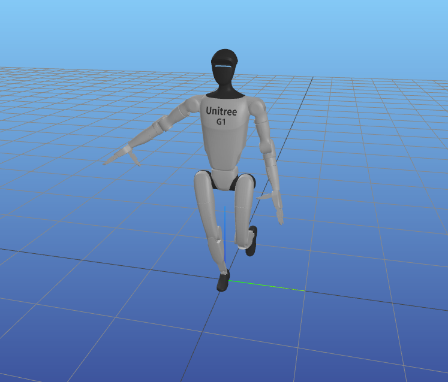
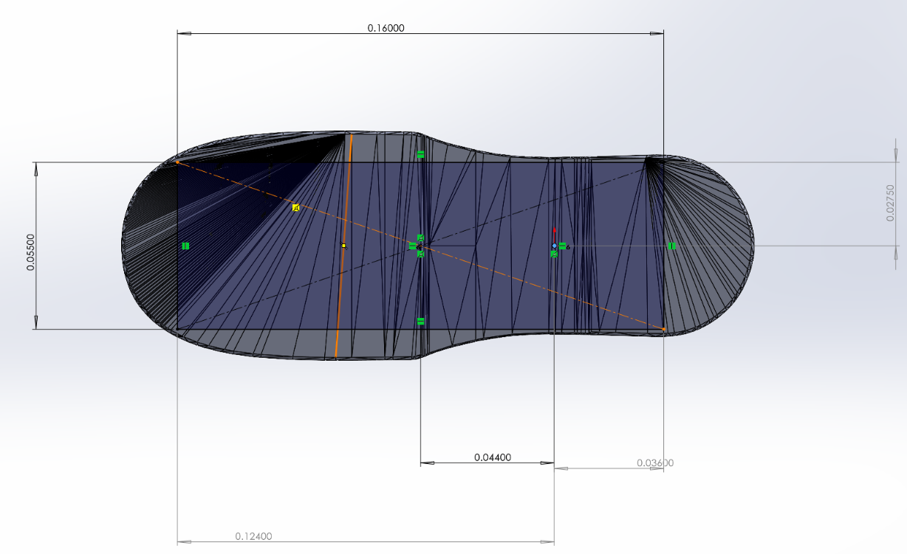
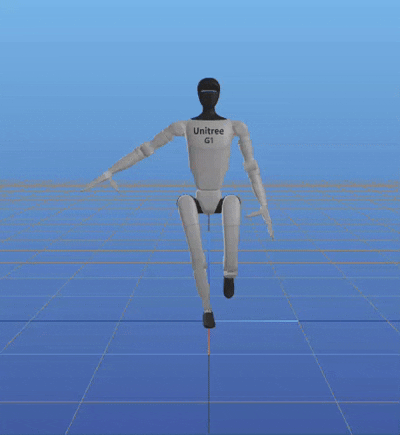

# Unitree_G1_Stabilization
This Git repository provides a Python script using the Pinocchio library and the Unitree G1 humanoid robot model 

#### Dependencies

* [meshcat](https://github.com/meshcat-dev/meshcat-python) >= 0.0.8
* [Pinocchio](https://github.com/stack-of-tasks/pinocchio)>=3.3.1 

* [robot_descriptions](https://github.com/robot-descriptions/robot_descriptions.py)  >=1.14.0 

* [shapely](https://github.com/shapely/shapely)  >=2.0.6 

## Task 1.1 
This part focuses on calculating the contact forces and joint torques for the robot standing on one foot in a given configuration. Additionally, it checks whether the configuration is stable or not based on the Zero Moment Point (ZMP). In this case, stability is determined by verifying if the projection of the Center of Mass (CoM) lies within the support polygon generated by the standing foot.

#### Unitree G1 standing on one foot
 
#### Support polygon (considered contact points)
 

## Task 1.2 
 This part simulate and visualize robot using PD controller for given stable configuration

 #### Simulation for stading on one foot polygon 
 

## Task 1.3 
Method for finding stable configuration, closest to the given.